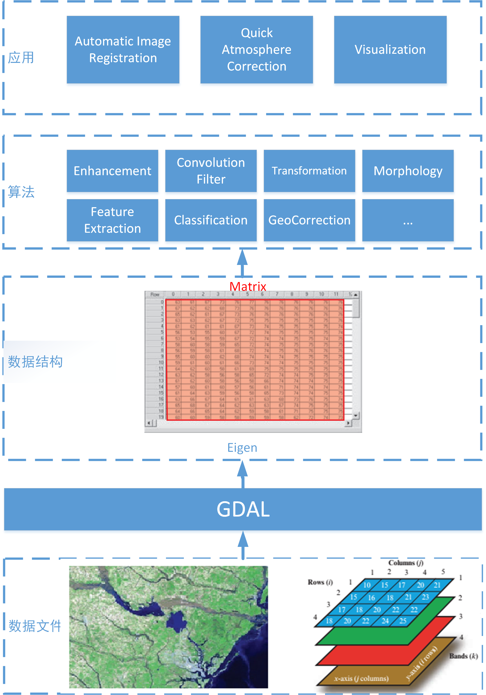

## 目录
- [一、课设目标](#一课设目标) 
- [二、课设要求](#二课设要求)
- [三、课设安排](#三课设安排)
- [四、课设内容](#四课设内容)
- [五、参考资料](#五参考资料)
- [六、问题讨论](#六问题讨论)

## 一、课设目标
遥感图像处理是遥感科学与技术专业的专业基础课，其核心内容是若干遥感图像处理算法和原理。本课程设计的主要目标培养学生既懂遥感图像处理算法理论，也懂遥感图像处理算法实现的专业素养和动手能力的专业人才，其具体目标为：
1. 强化学生对遥感图像处理算法原理的**理解**
2. 培养学生解决遥感应用问题的**设计能力**
3. 培养学生遥感图像处理算法的**编程能力**
4. 培养学生**交流沟通和书面表达能力**

[**返回目录**](#目录)
---

## 二、课设要求
### 1. 基本要求
1. 独立完成课设的内容，意味着你不能直接使用第三方的源码；
2. 程序语言原则上使用C/C++，若你有更为擅长的语言，也可以使用C#、Python、IDL、Matlab等；
3. 无论你使用哪种程序语言，都需要讲核心算法从底层实现起，这意味着你不得直接调用第三方库（如ENVI-IDL、OpenCV、Egien、Matlab等）已经封装的函数；
4. 课设的每一个算法，要有算法基本原理的讲解、算法实现的流程图、程序接口设计说明、源代码、算法处理的测试结果（与主流遥感图像处理软件结果对比）。
5. 编码需符合编码规范。工程文件的命名、组织、函数的命名、变量的命名必须为英文，简洁而明晰，并添加适当注释以确保程序的可读性。
6. 课程设计结束后**1 周内**，依照[**课设报告模板**](./contents/%E8%AF%BE%E8%AE%BE%E6%8A%A5%E5%91%8A.docx)撰写课设报告。
7. 课设报告中尽量避免引用大段的代码，保留界面截图和运行结果即可。
8. 提交纸质课设报告一份，课设报告和代码工程的电子档各一份，以班级为单位刻盘上交。

### 2.课程考核
1. 课设成绩由4部分如下表：

|序号|必做题|选做题（N选2）|附加题（N选1）|报告|
|:-:|:-:|:-:|:-:|:-:|
|分值比重|50%|20%|30%|20%|
|及格|√|×|×|√|
|中等|√|√|×|√|
|良好|√|×|√--|√|
|优秀|√|×|√|√|

2. 课设报告必须要封面、格式统一
3. 无论源代码或报告内容出现抄袭，一律零分处理

[**返回目录**](#目录)
---

## 三、课设安排
|次数|时间|周次|机房|备注|
|:---:|:---:|:---:|:---:|---|
|1|11.25|周一 下午|201||
|2|12.02|周一 下午|201||
|3|12.12|周四 上午|201||
|4|12.12|周四 下午|201|中期检查|
|5|12.17|周二 上午|201||
|6|12.17|周二 下午|201||
|7|12.19|周四 上午|201||
|8|12.19|周四 下午|201|终期检查|

[**返回目录**](#目录)
---

## 四、课设内容
本次课程的重点是图像处理算法，图像显示和GUI界面不作硬性要求，但所有算法需组织为整体，
可以提供控制台菜单选项或GUI界面均可。课设内容包括以下功能：

### 0. 准备工作
#### [0.开发环境配置](contents/D0_EnvSetup.md)
配置VS2017、Qt5、GDAL的文档。

### 1. 算法题（要求每人独立至少完成2题）

#### 影像数据读取与统计
- 功能：读取遥感文件为矩阵，计算相关统计量。
- 输入：遥感影像文件路径，文件大小不少于100MB，波段数不少于3个
- 输出：各个波段的最大值，最小值，均值，直方图，波段与波段间的相关系数
- 验证：与商用遥感软件对比输出结果。
- 要求：可以使用GDAL库，但统计量计算需自行编码，**不可调用GDAL接口**。

#### 影像增强-Enhancemen
- 功能：实现至少2种影像增强算法（直方图均衡化，对比度拉伸，频域滤波，空域滤波等）
- 输入：影像文件路径
- 参数：增强所需的参数
- 输出：增强后的结果影像文件路径
- 验证：与商用软件对比影像增强的正确性。
- 要求：不可以直接调用开源库已有接口。

#### 统计分类
- 功能：对输入图像执行分类算法（isodata，SVM，Maximum Likehood 中的一种）
- 输入：图像文件路径
- 参数：分类所需的参考
- 输出：分类后的结果图像
- 验证：与商用软件对比分类结果。
- 要求：不可直接调用已有开源库接口。

---

### 2. 综合题（3人一组，集成算法完成其中1题）
深度学习彻底改变了卫星和航空图像的分析与解译，解决了图像尺寸巨大、对象类别繁多等挑战。 
本题要求从分类、分割、对象检测、回归、云层检测和移除、图像融合、变化检测等方面选择[**某个专题**](./Exercise.md)，
查阅资料实现相关的算法，对比深度学习算法在所选专题方面的性能和优缺点。
相关资料可参考：<https://github.com/satellite-image-deep-learning>

[**返回目录**](#目录)
---

## 五、参考资料
### 1. 开源库
- [Qt入门](https://blog.csdn.net/Louis_815/article/details/54286544)
- [GDAL](http://www.gdal.org)
- [GDAL Document](https://gdal.org/gdal.pdf)
- [OpenCV](www.opencv.org)
- [CImg](www.cimg.eu)
- [CxImage](https://www.codeproject.com/Articles/1300/CxImage)
- [Eigen](<http://eigen.tuxfamily.org/index.php?title=Main_Page>)
- Eigen的配置和安装，请参考<https://blog.csdn.net/abcjennifer/article/details/7781936>。
- Eigen的使用，可以参考<https://zhuanlan.zhihu.com/p/31111908>。
- [satellite-image-deep-learning](https://github.com/satellite-image-deep-learning)

---

### 2. 程序架构示意图

## 六、问题讨论
如果你有关于本门课程设计的任何疑问、建议、指正，欢迎在[讨论专区](https://github.com/Wanghp119/RSIP/issues)中留言，我们将第一时间回复。

[**返回目录**](#目录)
---
