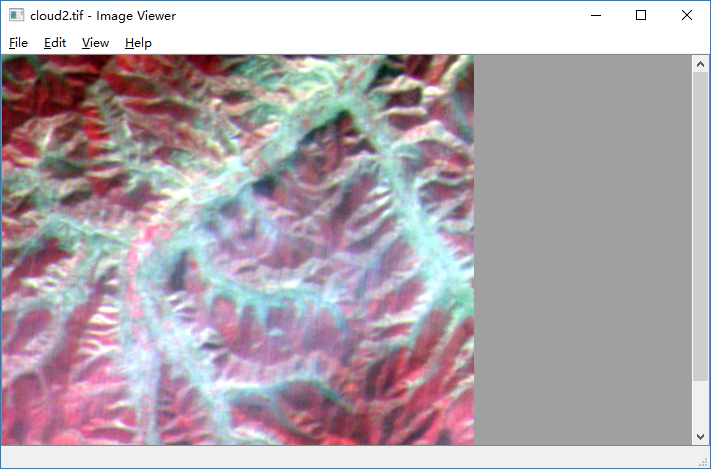

# 实习<一>程序框架构建
掌握Qt、MFC或其他界面框架，构建基本的系统原型，包括视图、菜单、工具栏等界面要素。

## 一、示例代码
参见Qt Image Viewer Example。
[code download](../src/imageviewer.rar)

                                      示例代码界面图

---
[Home](https://wanghp119.github.io/RSIP/) | [Return](#目录)  | [Next](./D2_RasterIO.md)

